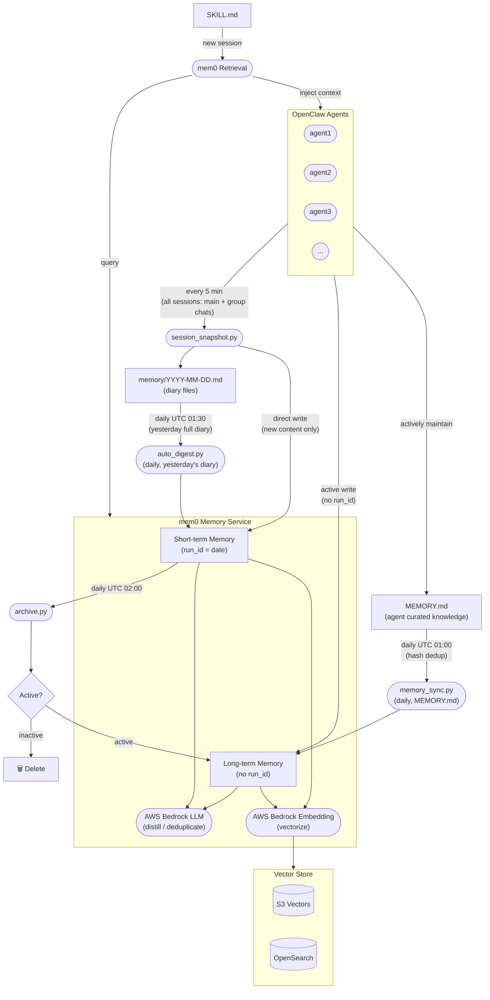

# Architecture

The mem0 Memory Service acts as the central memory layer for all OpenClaw agents. It receives session data through a pipeline (snapshot → digest → archive), distills it into semantic memories using AWS Bedrock, and serves relevant context back to agents on demand.



## Component Responsibilities

| Component | Role |
|---|---|
| **session_snapshot.py** | Runs every 5 minutes. Captures **all** agent sessions (direct chat + group chats) into daily diary files. Also writes new messages directly to mem0 short-term memory (run_id=date) for real-time cross-session sharing — skipped if no new content in the last 5 minutes. |
| **auto_digest.py** | Runs daily at UTC 01:30. Processes **yesterday's complete diary** in one pass — higher quality than incremental processing. Extracts key events using LLM and writes to mem0 as short-term memories (`run_id=date`). |
| **memory_sync.py** | Runs daily at UTC 01:00. Syncs each agent's `MEMORY.md` (curated knowledge) directly to mem0 long-term memory. Hash-based dedup skips unchanged files — zero LLM cost if nothing changed. |
| **archive.py** | Runs daily at UTC 02:00. Promotes active short-term memories to long-term (removes `run_id`); deletes inactive ones. |
| **mem0 Memory Service** | Core service. Uses AWS Bedrock LLM for memory distillation/deduplication and Bedrock Embedding for vectorization. |
| **Vector Store** | Persists memory vectors. Supports S3 Vectors or OpenSearch as the backend. |
| **SKILL.md → Retrieval** | On new agent sessions, reads SKILL.md, queries mem0 for relevant memories, and injects them as context. |

## Daily Pipeline Timeline (UTC)

```
01:00  memory_sync   — MEMORY.md → mem0 long-term  (curated knowledge, instant)
01:30  auto_digest   — yesterday's diary → mem0 short-term  (full-day context)
02:00  archive       — 7-day-old short-term → promote or delete
```

## Memory Tiering: Who Decides Long vs. Short-Term?

mem0 itself has no concept of short-term or long-term — it stores everything permanently by default. **The distinction is entirely controlled by whether `run_id` is present when writing.**

| | Short-term | Long-term |
|---|---|---|
| **`run_id`** | `YYYY-MM-DD` (date string) | absent |
| **Written by** | `auto_digest.py` (automated) | Agent explicitly, `memory_sync.py`, or `archive.py` (promoted) |
| **Lifetime** | 7 days → evaluated for promotion | Permanent |
| **Typical content** | Daily discussions, task progress, temp decisions | Tech decisions, lessons learned, user preferences |

### Three paths to long-term memory

**Path 1 — `memory_sync.py`** (daily, from `MEMORY.md`)

Each agent's `MEMORY.md` is the highest-quality memory source — curated directly by the agent during heartbeats. `memory_sync.py` syncs it to mem0 long-term memory every day at UTC 01:00, with hash-based dedup to avoid redundant LLM calls.

This is the **fastest path**: important decisions and lessons reach long-term memory the same day, without waiting for the 7-day archive cycle.

**Path 2 — `archive.py`** (daily, automatic promotion from short-term)

After 7 days, each short-term memory is evaluated:
- Semantically search the past 6 days of short-term memories
- If a similar topic is found with score ≥ 0.75 → **promoted** (re-written without `run_id`)
- Otherwise → **deleted**

This handles topics that were discussed over multiple days but never explicitly captured in `MEMORY.md`.

**Path 3 — Agent explicit write** (on-demand)

Agents write directly to long-term memory by omitting `run_id`:

```bash
python3 cli.py add --user boss --agent agent1 \
  --text "Decided to use S3 Vectors as the primary vector store" \
  --metadata '{"category":"decision"}'
```

### The `run_id` mechanism

`run_id` is mem0's native per-run isolation key. We repurpose it as a date-scoped namespace:

```
run_id = "2026-03-27"   →  short-term (today's entries)
run_id = absent          →  long-term  (permanent)
```

## Design Philosophy

### Why session_snapshot exists

OpenClaw resets the active session daily (default 4:00 AM) or after an idle timeout, creating a fresh context window each time. Without a bridge mechanism, all conversation history would be lost on every session reset.

`session_snapshot.py` is that bridge: it captures conversations into diary files every 5 minutes, which are then distilled into mem0 by `auto_digest.py`. When a new session starts, SKILL.md triggers a retrieval from mem0 — restoring context seamlessly across session boundaries.

### Why daily digest instead of incremental

The original design processed diary files incrementally every 15 minutes, requiring complex offset tracking via `.digest_state.json`. This caused:
- ~96 LLM calls/day per agent (high cost, low quality per call)
- Fragmented extraction from partial conversations
- Complex state management prone to desync bugs

Processing yesterday's **complete diary once** per day gives the LLM full context of everything that happened, producing higher-quality memories at 1/96th the cost.

### Why MEMORY.md sync is a separate path

`MEMORY.md` is maintained by agents themselves during heartbeats — it's the distilled, curated essence of what the agent has learned. This is qualitatively different from diary-extracted short-term memories.

Routing `MEMORY.md` directly to long-term memory (bypassing the 7-day short-term → archive cycle) ensures that explicitly curated knowledge is available immediately in subsequent sessions.
