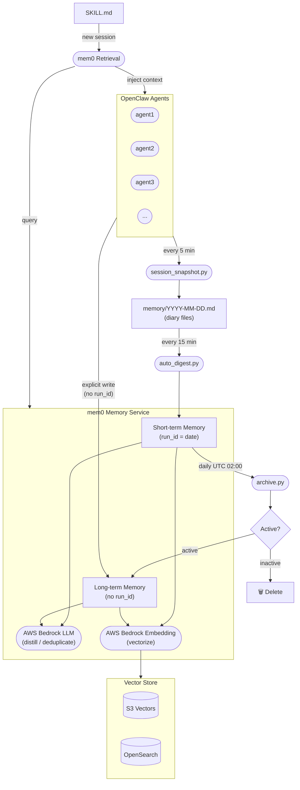

# Architecture

The mem0 Memory Service acts as the central memory layer for all OpenClaw agents. It receives raw session data through a three-stage pipeline (snapshot → digest → archive), distills it into semantic memories using AWS Bedrock, and serves relevant context back to agents on demand.



## Component Responsibilities

| Component | Role |
|---|---|
| **session_snapshot.py** | Runs every 5 minutes. Captures each agent's session state into daily diary files (`memory/YYYY-MM-DD.md`). |
| **auto_digest.py** | Runs every 15 minutes. Sends diary content to mem0 as short-term memories tagged with `run_id=date`. |
| **archive.py** | Runs daily at UTC 02:00. Promotes active short-term memories to long-term (removes `run_id`); deletes inactive ones. |
| **mem0 Memory Service** | Core service. Uses AWS Bedrock LLM for memory distillation/deduplication and Bedrock Embedding for vectorization. |
| **Vector Store** | Persists memory vectors. Supports S3 Vectors or OpenSearch as the backend. |
| **SKILL.md → Retrieval** | On new agent sessions, reads SKILL.md, queries mem0 for relevant memories, and injects them as context. |

## Memory Tiering: Who Decides Long vs. Short-Term?

mem0 itself has no concept of short-term or long-term — it stores everything permanently by default. **The distinction is entirely controlled by whether `run_id` is present when writing.**

| | Short-term | Long-term |
|---|---|---|
| **`run_id`** | `YYYY-MM-DD` (date string) | absent |
| **Written by** | `auto_digest.py` (automated) | Agent explicitly, or `archive.py` (promoted) |
| **Lifetime** | 7 days → evaluated for promotion | Permanent |
| **Typical content** | Daily discussions, task progress, temp decisions | Tech decisions, lessons learned, user preferences |

### Two paths to long-term memory

**Path 1 — Automatic promotion via `archive.py`** (passive, daily)

After 7 days, each short-term memory is evaluated:
- Semantically search the past 6 days of short-term memories
- If a similar topic is found with score ≥ 0.75 → **promoted** (re-written without `run_id`)
- Otherwise → **deleted**

This is smarter than time-based hard expiry: topics that are still actively discussed get preserved; one-off events don't clutter long-term memory.

**Path 2 — Agent explicit write** (active, on-demand)

Agents write directly to long-term memory by omitting `run_id`:

```bash
python3 cli.py add --user boss --agent agent1 \
  --text "Decided to use S3 Vectors as the primary vector store" \
  --metadata '{"category":"decision"}'
```

This is the preferred path for important decisions, lessons learned, or user preferences that should be retained immediately — without waiting 7 days for the archive cycle.

### The `run_id` mechanism

`run_id` is mem0's native per-run isolation key. We repurpose it as a date-scoped namespace:

```
run_id = "2026-03-27"   →  short-term (today's entries)
run_id = absent          →  long-term  (permanent)
```

Retrieval respects this: you can search long-term only, short-term only (specific date), or both combined (`--combined`).

