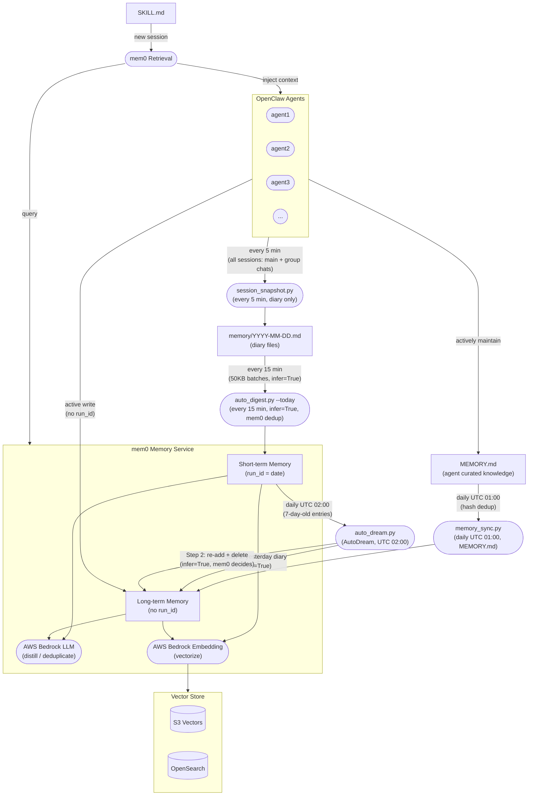

# Architecture

The mem0 Memory Service acts as the central memory layer for all OpenClaw agents. It receives session data through a pipeline (snapshot → digest → dream), distills it into semantic memories using AWS Bedrock, and serves relevant context back to agents on demand.



## Component Responsibilities

| Component | Role |
|---|---|
| **session_snapshot.py** | Runs every 5 minutes. Captures **all** agent sessions (direct chat + group chats) into daily diary files. **Does not write to mem0 directly** — mem0 ingestion is handled entirely by auto_digest. |
| **auto_digest.py --today** | Runs every 15 minutes. Reads only the **new bytes** added since the last run (tracked via `auto_digest_offset.json`). Sends content to mem0 in **section-aligned batches** (up to ~50KB each, aligned to `## ` diary section boundaries) with `infer=True` — mem0 handles fact extraction and deduplication automatically. Offset is persisted after each successful batch, enabling crash-safe resume. |
| **memory_sync.py** | Runs daily at UTC 01:00. Syncs each agent's `MEMORY.md` (curated knowledge) directly to mem0 long-term memory. Hash-based dedup skips unchanged files — zero LLM cost if nothing changed. |
| **auto_dream.py** / **AutoDream** | Runs daily at UTC 02:00. **Step 1**: reads yesterday's complete diary → `mem0.add(infer=True, no run_id)` → long-term memory. **Step 2**: for each 7-day-old short-term memory, re-adds it to mem0 with `infer=True` (no run_id) — mem0 natively decides ADD/UPDATE/DELETE/NONE — then deletes the original short-term entry. |
| **mem0 Memory Service** | Core service. Uses AWS Bedrock LLM for memory distillation/deduplication and Bedrock Embedding for vectorization. |
| **Vector Store** | Persists memory vectors. Supports S3 Vectors or OpenSearch as the backend. |
| **SKILL.md → Retrieval** | On new agent sessions, reads SKILL.md, queries mem0 for relevant memories, and injects them as context. |

## Pipeline Timeline (UTC)

```
Every 5 min   session_snapshot    — conversations → diary files  (no mem0 write)
Every 15 min  auto_digest --today — diary new bytes → mem0 short-term  (infer=True, mem0 dedup)
01:00         memory_sync         — MEMORY.md → mem0 long-term  (curated knowledge, instant)
02:00         auto_dream          — Step1: yesterday diary → long-term (infer=True)
                                    Step2: 7-day-old short-term → re-add (infer=True) + delete
```

## Memory Tiering: Who Decides Long vs. Short-Term?

mem0 itself has no concept of short-term or long-term — it stores everything permanently by default. **The distinction is entirely controlled by whether `run_id` is present when writing.**

| | Short-term | Long-term |
|---|---|---|
| **`run_id`** | `YYYY-MM-DD` (date string) | absent |
| **Written by** | `auto_digest.py --today` (automated) | Agent explicitly, `memory_sync.py`, or `auto_dream.py` / AutoDream (consolidated via infer=True) |
| **Lifetime** | 7 days → consolidated by auto_dream | Permanent |
| **Typical content** | Daily discussions, task progress, temp decisions | Tech decisions, lessons learned, user preferences |

### Three paths to long-term memory

**Path 1 — `memory_sync.py`** (daily UTC 01:00, from `MEMORY.md`)

Each agent's `MEMORY.md` is the highest-quality memory source — curated directly by the agent during heartbeats. `memory_sync.py` syncs it to mem0 long-term memory every day at UTC 01:00, with hash-based dedup to avoid redundant LLM calls.

This is the **fastest path**: important decisions and lessons reach long-term memory the same day, without waiting for the 7-day archive cycle.

**Path 2 — `auto_dream.py` / AutoDream** (daily UTC 02:00)

Runs two steps each night:

- **Step 1**: Reads yesterday's complete diary and writes it to mem0 with `infer=True` (no `run_id`) — directly into long-term memory with full-day context for high-quality extraction.
- **Step 2**: For each 7-day-old short-term memory, re-adds it to mem0 with `infer=True` (no `run_id`). mem0 natively decides whether to ADD (new knowledge), UPDATE (merge with existing), DELETE (redundant), or NONE (no action). The original short-term entry is then deleted.

This leverages mem0's native intelligence instead of hand-written semantic search, eliminating thousands of redundant Bedrock API calls per run.

**Path 3 — Agent explicit write** (on-demand)

Agents write directly to long-term memory by omitting `run_id`:

```bash
python3 cli.py add --user boss --agent agent1 \
  --text "Decided to use S3 Vectors as the primary vector store" \
  --metadata '{"category":"decision"}'
```

### The `run_id` mechanism

`run_id` is mem0's native per-run isolation key. We repurpose it as a date-scoped namespace:

```
run_id = "2026-03-27"   →  short-term (today's entries)
run_id = absent          →  long-term  (permanent)
```

## Design Philosophy

### Diary-to-mem0 pipeline

**`auto_digest.py --today` (every 15 min, incremental)**

Runs every 15 minutes, reading only new diary content since the last run. Sends **section-aligned batches** (up to ~50KB each, aligned to `## ` diary section boundaries) to mem0 with `infer=True` — mem0 handles fact extraction and deduplication automatically. Offset is saved after each successful batch — if the process is interrupted, the next run picks up where it left off.

This provides **real-time cross-session memory**: conversations from the last ~15 minutes are available for retrieval in other sessions of the same agent.

**`auto_dream.py` Step 1 (UTC 02:00, yesterday diary → long-term)**

Runs once per day. Reads yesterday's complete diary and writes it to mem0 with `infer=True` (no `run_id`) — directly as long-term memory. With the full day's context available, mem0 produces higher-quality, deduplicated memories.

This provides **high-quality nightly long-term memory** from the full day's context.

### Why session_snapshot no longer writes to mem0

Originally, `session_snapshot.py` wrote new messages directly to mem0 on every 5-minute run. This caused thread explosion: each write triggered mem0's internal LLM (fact extraction) + embedding pipeline simultaneously across multiple agents, overwhelming the service.

The fix is clean separation of concerns:
- `session_snapshot` → **diary files only** (fast, no external calls)
- `auto_digest --today` → **mem0 writes** (rate-controlled, section-aligned 50KB batches with sleep between)

### Why MEMORY.md sync is a separate path

`MEMORY.md` is maintained by agents themselves during heartbeats — it's the distilled, curated essence of what the agent has learned. This is qualitatively different from diary-extracted short-term memories.

Routing `MEMORY.md` directly to long-term memory (bypassing the 7-day short-term → archive cycle) ensures that explicitly curated knowledge is available immediately in subsequent sessions.
