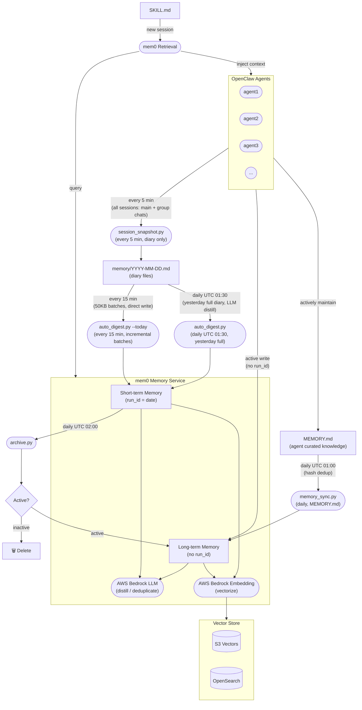

# Architecture

The mem0 Memory Service acts as the central memory layer for all OpenClaw agents. It receives session data through a pipeline (snapshot → digest → archive), distills it into semantic memories using AWS Bedrock, and serves relevant context back to agents on demand.



## Component Responsibilities

| Component | Role |
|---|---|
| **session_snapshot.py** | Runs every 5 minutes. Captures **all** agent sessions (direct chat + group chats) into daily diary files. **Does not write to mem0 directly** — mem0 ingestion is handled entirely by auto_digest. |
| **auto_digest.py --today** | Runs every 15 minutes. Reads only the **new bytes** added since the last run (tracked via `auto_digest_offset.json`). Sends content to mem0 in 50KB batches directly — mem0 handles fact extraction internally. Offset is persisted after each successful batch, enabling crash-safe resume. |
| **auto_digest.py** (daily) | Runs daily at UTC 01:30. Processes **yesterday's complete diary** in one pass using LLM distillation — higher quality extraction with full-day context. Writes to mem0 as short-term memories (`run_id=date`). |
| **memory_sync.py** | Runs daily at UTC 01:00. Syncs each agent's `MEMORY.md` (curated knowledge) directly to mem0 long-term memory. Hash-based dedup skips unchanged files — zero LLM cost if nothing changed. |
| **archive.py** | Runs daily at UTC 02:00. Promotes active short-term memories to long-term (removes `run_id`); deletes inactive ones. |
| **mem0 Memory Service** | Core service. Uses AWS Bedrock LLM for memory distillation/deduplication and Bedrock Embedding for vectorization. |
| **Vector Store** | Persists memory vectors. Supports S3 Vectors or OpenSearch as the backend. |
| **SKILL.md → Retrieval** | On new agent sessions, reads SKILL.md, queries mem0 for relevant memories, and injects them as context. |

## Pipeline Timeline (UTC)

```
Every 5 min   session_snapshot  — conversations → diary files  (no mem0 write)
Every 15 min  auto_digest --today — diary new bytes → mem0 short-term  (real-time, batched)
01:00         memory_sync       — MEMORY.md → mem0 long-term  (curated knowledge, instant)
01:30         auto_digest       — yesterday's diary → mem0 short-term  (full-day LLM distill)
02:00         archive           — 7-day-old short-term → promote or delete
```

## Memory Tiering: Who Decides Long vs. Short-Term?

mem0 itself has no concept of short-term or long-term — it stores everything permanently by default. **The distinction is entirely controlled by whether `run_id` is present when writing.**

| | Short-term | Long-term |
|---|---|---|
| **`run_id`** | `YYYY-MM-DD` (date string) | absent |
| **Written by** | `auto_digest.py` (automated) | Agent explicitly, `memory_sync.py`, or `archive.py` (promoted) |
| **Lifetime** | 7 days → evaluated for promotion | Permanent |
| **Typical content** | Daily discussions, task progress, temp decisions | Tech decisions, lessons learned, user preferences |

### Three paths to long-term memory

**Path 1 — `memory_sync.py`** (daily, from `MEMORY.md`)

Each agent's `MEMORY.md` is the highest-quality memory source — curated directly by the agent during heartbeats. `memory_sync.py` syncs it to mem0 long-term memory every day at UTC 01:00, with hash-based dedup to avoid redundant LLM calls.

This is the **fastest path**: important decisions and lessons reach long-term memory the same day, without waiting for the 7-day archive cycle.

**Path 2 — `archive.py`** (daily, automatic promotion from short-term)

After 7 days, each short-term memory is evaluated:
- Semantically search the past 6 days of short-term memories
- If a similar topic is found with score ≥ 0.75 → **promoted** (re-written without `run_id`)
- Otherwise → **deleted**

This handles topics that were discussed over multiple days but never explicitly captured in `MEMORY.md`.

**Path 3 — Agent explicit write** (on-demand)

Agents write directly to long-term memory by omitting `run_id`:

```bash
python3 cli.py add --user boss --agent agent1 \
  --text "Decided to use S3 Vectors as the primary vector store" \
  --metadata '{"category":"decision"}'
```

### The `run_id` mechanism

`run_id` is mem0's native per-run isolation key. We repurpose it as a date-scoped namespace:

```
run_id = "2026-03-27"   →  short-term (today's entries)
run_id = absent          →  long-term  (permanent)
```

## Design Philosophy

### Two-layer diary-to-mem0 pipeline

The diary → mem0 pipeline uses two complementary passes:

**Layer 1 — `auto_digest.py --today` (every 15 min, incremental)**

Runs every 15 minutes, reading only new diary content since the last run. Sends 50KB batches directly to mem0, letting mem0's own fact extraction handle distillation. Offset is saved after each successful batch — if the process is interrupted, the next run picks up where it left off.

This provides **real-time memory**: conversations from the last 15 minutes are available for retrieval within the same day.

**Layer 2 — `auto_digest.py` (daily, full LLM distill)**

Runs once per day on yesterday's complete diary. With the full day's context available, the LLM produces higher-quality, deduplicated memories that capture the day's overall arc rather than isolated fragments.

This provides **high-quality retrospective memory** without the cost of running LLM on every incremental batch.

### Why session_snapshot no longer writes to mem0

Originally, `session_snapshot.py` wrote new messages directly to mem0 on every 5-minute run. This caused thread explosion: each write triggered mem0's internal LLM (fact extraction) + embedding pipeline simultaneously across multiple agents, overwhelming the service.

The fix is clean separation of concerns:
- `session_snapshot` → **diary files only** (fast, no external calls)
- `auto_digest --today` → **mem0 writes** (rate-controlled, 50KB batches with sleep between)

### Why MEMORY.md sync is a separate path

`MEMORY.md` is maintained by agents themselves during heartbeats — it's the distilled, curated essence of what the agent has learned. This is qualitatively different from diary-extracted short-term memories.

Routing `MEMORY.md` directly to long-term memory (bypassing the 7-day short-term → archive cycle) ensures that explicitly curated knowledge is available immediately in subsequent sessions.
