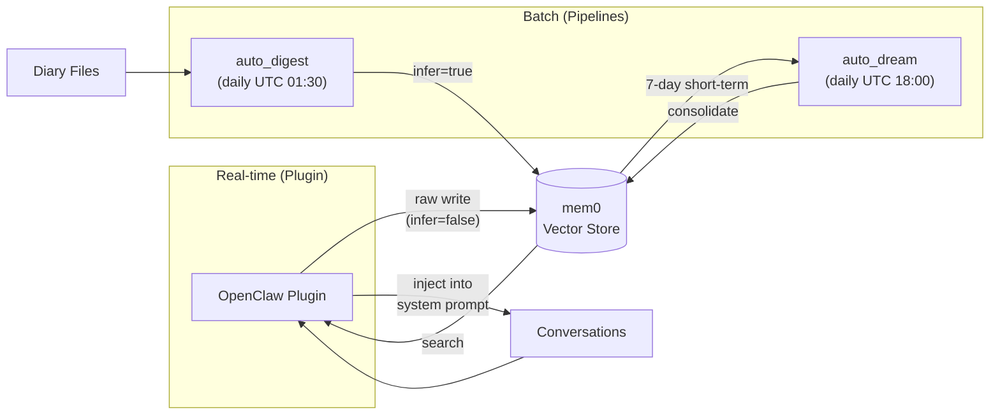
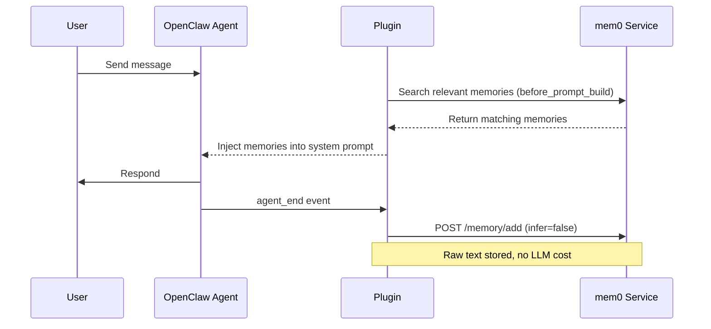
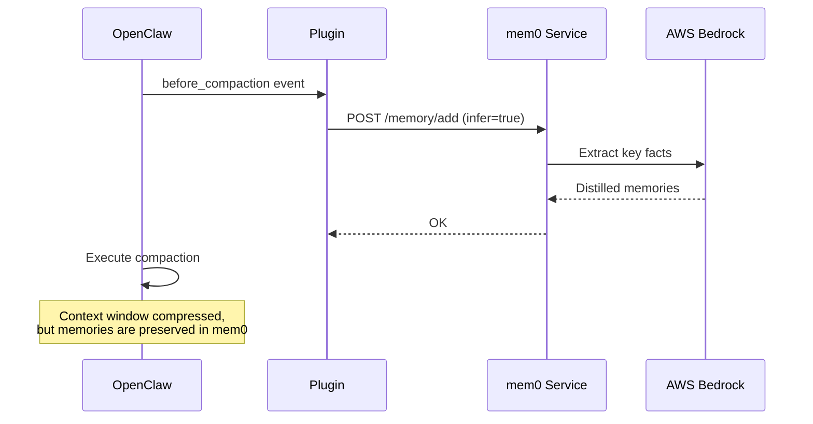

# OpenClaw Plugin

The mem0 Memory Plugin hooks into OpenClaw's agent lifecycle to provide real-time memory capture and retrieval — no cron jobs, no diary files. Every meaningful conversation turn is written to mem0 as it happens, and relevant memories are injected into the system prompt before each response.

## Architecture

### How the Plugin Fits into the Memory System



The plugin and the existing pipelines are complementary:

| Component | Trigger | Write Mode | Purpose |
|-----------|---------|------------|---------|
| **Plugin** (`agent_end`) | Every conversation turn | `infer=false` (raw) | Immediate capture, zero LLM cost |
| **Plugin** (`before_compaction`) | Before session compaction | `infer=true` | LLM-distilled write before context is lost |
| **Plugin** (`before_prompt_build`) | Before each response | Search only | Inject relevant memories into prompt |
| `auto_digest` | Daily UTC 01:30 (cron) | `infer=true` | Extract facts from diary files |
| `auto_dream` | Daily UTC 18:00 (cron) | `infer=true` | Consolidate short-term → long-term |

### Sequence: Normal Conversation Turn



### Sequence: Session Compaction



## Plugin Hooks

### `agent_end` — Write Conversation Turns

Fires after each agent turn completes successfully. Extracts the last user+assistant exchange and writes it to mem0.

**Behavior:**
- Skips if the exchange is shorter than `minExchangeLength` (default 100 chars)
- Debounced per session — at most one write per `debounceMs` (default 60s)
- Writes with `infer=false` by default (raw text, no LLM cost)
- Set `enableWrite=true` to use `infer=true` instead (LLM extracts key facts)

### `before_compaction` — Flush Before Context Loss

Fires when OpenClaw is about to compress the session context. Writes the last exchange to mem0 with `infer=true` so the LLM distills key facts before the full context is lost.

**Behavior:**
- Always uses `infer=true` — this is the last chance to capture context
- No debounce — compaction is infrequent and critical

### `before_prompt_build` — Inject Memories

Fires before each agent response is generated. Searches mem0 for memories relevant to the current user prompt and prepends them to the system context.

**Behavior:**
- Extracts the first 200 characters of the user prompt as the search query
- Returns up to `injectLimit` results (default 5), truncated to `injectMaxChars` (default 800)
- Times out after `injectTimeoutMs` (default 3s) — silently skips on timeout
- Injected as a `## Relevant Memories` section prepended to the prompt

## Configuration

All configuration is set in `openclaw.plugin.json` or passed via OpenClaw's plugin config system.

| Option | Type | Default | Description |
|--------|------|---------|-------------|
| `mem0Url` | string | `http://localhost:8230` | mem0 service endpoint |
| `userId` | string | `boss` | User ID for mem0 operations |
| `agentIds` | string[] | `["dev","main","pm","researcher","pjm","prototype"]` | Agent IDs to process (empty = all) |
| `enableWrite` | boolean | `false` | Enable `agent_end` writes with `infer=true` |
| `enableRawWrite` | boolean | `true` | Enable `agent_end` writes with `infer=false` (takes effect when `enableWrite=false`) |
| `enableInject` | boolean | `false` | Enable memory injection via `before_prompt_build` |
| `enableCompactionFlush` | boolean | `true` | Enable `before_compaction` flush to mem0 |
| `minExchangeLength` | number | `100` | Minimum exchange length (chars) to trigger a write |
| `injectLimit` | number | `5` | Max memories to inject per prompt |
| `injectMaxChars` | number | `800` | Max total chars for injected memories |
| `debounceMs` | number | `60000` | Debounce interval per session (ms) |
| `injectTimeoutMs` | number | `3000` | Timeout for memory search (ms) |

> **`enableWrite` vs `enableRawWrite`**: When `enableWrite=true`, conversations are written with `infer=true` (LLM extracts facts — higher quality, costs LLM tokens). When `enableWrite=false` and `enableRawWrite=true`, conversations are stored as raw text with `infer=false` (zero LLM cost, relies on `auto_dream` for later distillation). Only one mode is active at a time; `enableWrite` takes priority.

## Installation

### 1. Copy the Plugin

```bash
cp -r openclaw-plugin ~/.openclaw/plugins/mem0-memory-plugin
```

### 2. Enable in OpenClaw Settings

Add the plugin to your `openclaw.json`:

```json
{
  "plugins": {
    "mem0-memory-plugin": {
      "enabled": true,
      "config": {
        "mem0Url": "http://localhost:8230",
        "userId": "boss",
        "enableWrite": false,
        "enableRawWrite": true,
        "enableInject": true
      }
    }
  }
}
```

### 3. Verify

After enabling, check the OpenClaw logs for:

```
[mem0-plugin] Registered. mem0Url=http://localhost:8230 userId=boss agentIds=dev,main,pm,researcher,pjm,prototype
```

## Recommended Setup

For most users, we recommend **raw write mode** (`enableRawWrite=true`, `enableWrite=false`):

```json
{
  "enableWrite": false,
  "enableRawWrite": true,
  "enableInject": true
}
```

**Why?**
- `agent_end` writes raw text with zero LLM cost — conversations are captured immediately
- `before_compaction` always uses `infer=true` — critical context is distilled before loss
- `auto_dream` (nightly) consolidates raw memories into high-quality long-term knowledge
- Memory injection gives agents context from past conversations in real time

This gives you the best balance of cost, latency, and memory quality.

## Relationship with Existing Pipelines

The plugin does **not** replace the existing pipeline system. They work together:

```
Real-time path (Plugin):
  Conversation → agent_end → mem0 (raw, immediate)
  Compaction   → before_compaction → mem0 (infer, critical)
  Prompt       → before_prompt_build → search → inject

Batch path (Pipelines):
  Session → session_snapshot (5 min) → diary file
  Diary   → auto_digest (daily UTC 01:30) → mem0 short-term
  Nightly → auto_dream (UTC 18:00) → long-term consolidation
```

- **Plugin** provides real-time capture and retrieval — no delay between conversation and memory availability
- **Pipelines** provide structured diary management and nightly consolidation — higher quality long-term memories
- Both paths write to the same mem0 instance — mem0's built-in deduplication prevents duplicates
