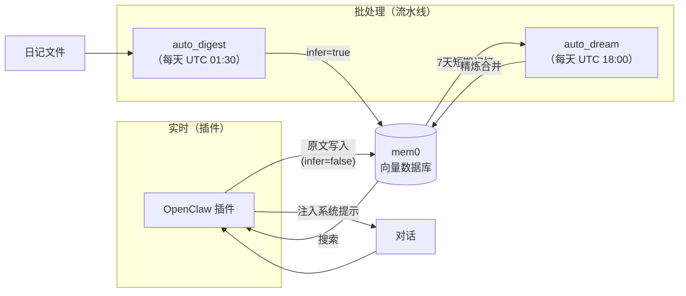
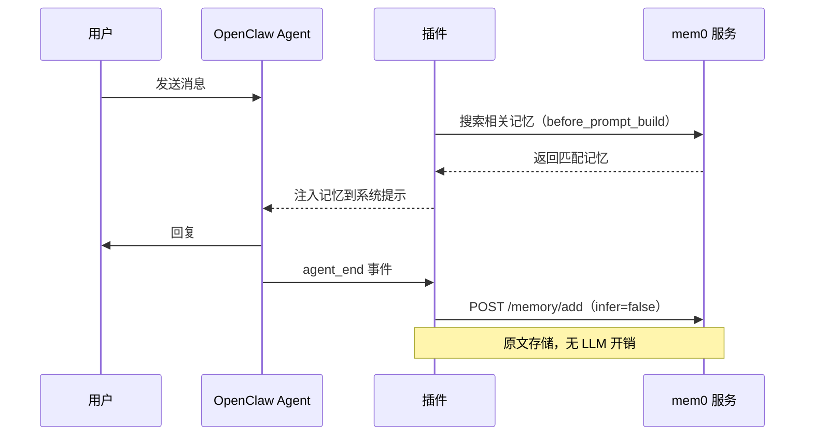
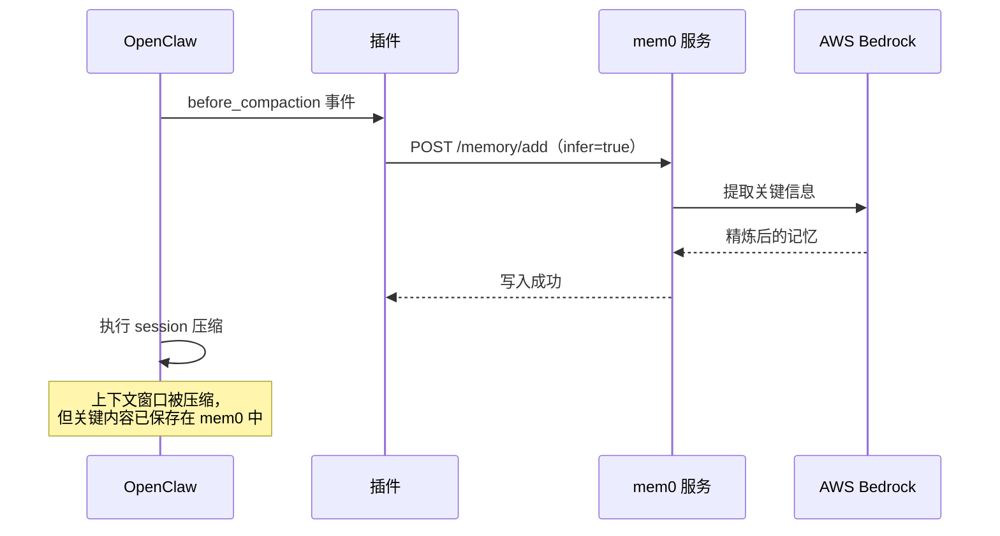

# OpenClaw 插件

mem0 Memory Plugin 通过 Hook 系统接入 OpenClaw 的 agent 生命周期，实现实时记忆写入——无需 cron 任务，无需日记文件。每次有实质内容的对话都会即时写入 mem0，同时在生成回复前将相关记忆注入系统提示。

## 架构

### 插件在整个记忆系统中的位置



插件与现有流水线互补，各司其职：

| 组件 | 触发时机 | 写入方式 | 用途 |
|------|---------|---------|------|
| **插件**（`agent_end`） | 每次对话 turn 结束 | `infer=false`（原文） | 即时捕获，零 LLM 开销 |
| **插件**（`before_compaction`） | session 压缩前 | `infer=true` | 压缩前 LLM 提炼，防止上下文丢失 |
| **插件**（`before_prompt_build`） | 每次生成回复前 | 仅搜索 | 将相关记忆注入 prompt |
| `auto_digest` | 每天 UTC 01:30（cron） | `infer=true` | 从日记文件提取结构化记忆 |
| `auto_dream` | 每天 UTC 18:00 | `infer=true` | 短期记忆 → 长期记忆精炼 |

### 时序图：正常对话 turn



### 时序图：session 压缩时



## Hook 说明

### `agent_end` — 写入对话内容

每次 agent turn 成功结束后触发，提取最后一轮 user + assistant 对话写入 mem0。

**行为：**
- 对话内容不足 `minExchangeLength`（默认 100 字）时跳过，过滤寒暄等无效内容
- 每个 session 有 debounce 保护，`debounceMs`（默认 60 秒）内最多写一次
- `enableRawWrite=true` 时使用 `infer=false`（原文存储，零 LLM 开销）
- `enableWrite=true` 时使用 `infer=true`（LLM 提取关键事实，质量更高但有开销）

### `before_compaction` — 压缩前兜底写入

OpenClaw 即将压缩 session 上下文时触发，将当前对话以 `infer=true` 写入 mem0，确保在上下文丢失前完成 LLM 提炼。

**行为：**
- 始终使用 `infer=true`——这是压缩前最后的捕获机会
- 无 debounce 限制——压缩频率低且关键

### `before_prompt_build` — 注入记忆

每次生成回复前触发，用当前用户消息搜索 mem0，将相关记忆前置注入系统上下文。

**行为：**
- 取用户消息前 200 字作为搜索 query
- 最多返回 `injectLimit`（默认 5）条，截断至 `injectMaxChars`（默认 800 字）
- 超过 `injectTimeoutMs`（默认 3 秒）自动跳过，不阻塞回复
- 以 `## Relevant Memories` 段落形式注入系统提示

## 配置项

所有配置通过 OpenClaw 的 `plugins.entries` 传入。

| 配置项 | 类型 | 默认值 | 说明 |
|--------|------|--------|------|
| `mem0Url` | string | `http://localhost:8230` | mem0 服务地址 |
| `userId` | string | `boss` | mem0 用户 ID |
| `agentIds` | string[] | `["dev","main","pm","researcher","pjm","prototype"]` | 处理的 agent ID 列表（空数组=全部） |
| `enableWrite` | boolean | `false` | 开启 `agent_end` 写入（infer=true） |
| `enableRawWrite` | boolean | `true` | 开启 `agent_end` 原文写入（infer=false，enableWrite=false 时生效） |
| `enableInject` | boolean | `false` | 开启 `before_prompt_build` 记忆注入 |
| `enableCompactionFlush` | boolean | `true` | 开启 `before_compaction` 压缩前写入 |
| `minExchangeLength` | number | `100` | 触发写入的最小对话长度（字符数） |
| `injectLimit` | number | `5` | 每次注入的最大记忆条数 |
| `injectMaxChars` | number | `800` | 注入内容的最大字符数 |
| `debounceMs` | number | `60000` | 每个 session 写入去重窗口（毫秒） |
| `injectTimeoutMs` | number | `3000` | 记忆搜索超时时间（毫秒） |

> **`enableWrite` 与 `enableRawWrite` 的区别**：`enableWrite=true` 时对话以 `infer=true` 写入，LLM 自动提取关键事实（质量高，有 LLM 开销）。`enableWrite=false` 且 `enableRawWrite=true` 时以原文写入（零 LLM 开销，依赖 `auto_dream` 夜间精炼）。两者互斥，`enableWrite` 优先级更高。

## 安装配置

### 1. 加载插件

在 `~/.openclaw/openclaw.json` 中添加插件加载路径：

```json
{
  "plugins": {
    "load": {
      "paths": [
        "/path/to/mem0-memory-service/openclaw-plugin"
      ]
    },
    "entries": {
      "openclaw-plugin": {
        "enabled": true,
        "config": {
          "mem0Url": "http://localhost:8230",
          "userId": "boss",
          "enableWrite": false,
          "enableRawWrite": true,
          "enableInject": false
        }
      }
    }
  }
}
```

### 2. 验证加载成功

重启 OpenClaw 后，查看日志中是否出现：

```
[mem0-plugin] Registered. mem0Url=http://localhost:8230 userId=boss agentIds=dev,main,pm,...
```

## 推荐配置

对大多数用户，建议使用**原文写入模式**（`enableRawWrite=true`，`enableWrite=false`）：

```json
{
  "enableWrite": false,
  "enableRawWrite": true,
  "enableInject": false
}
```

**原因：**
- `agent_end` 原文写入，零 LLM 开销，对话即时被捕获
- `before_compaction` 始终使用 `infer=true`，关键上下文在压缩前得到提炼
- `auto_dream` 每晚将原文记忆整合为高质量长期知识
- 注入功能（`enableInject`）可按需开启，频率高时建议关闭

## 与现有流水线的关系

插件**不替代**现有的流水线系统，两者协作运行：

```
实时路径（插件）：
  对话  → agent_end          → mem0（原文，即时）
  压缩  → before_compaction  → mem0（LLM提炼，兜底）
  提示  → before_prompt_build → 搜索 → 注入

批处理路径（流水线）：
  session → session_snapshot（5分钟）→ 日记文件
  日记    → auto_digest（每天 UTC 01:30）  → mem0 短期记忆
  每晚    → auto_dream（UTC 18:00）        → 长期记忆精炼
```

- **插件**提供实时捕获——对话结束即可被记忆，无延迟
- **流水线**提供结构化日记管理和夜间精炼——长期记忆质量更高
- 两条路径写入同一个 mem0 实例，mem0 内置去重机制防止重复
