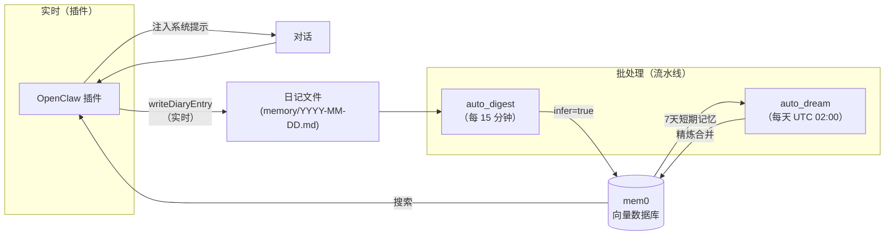
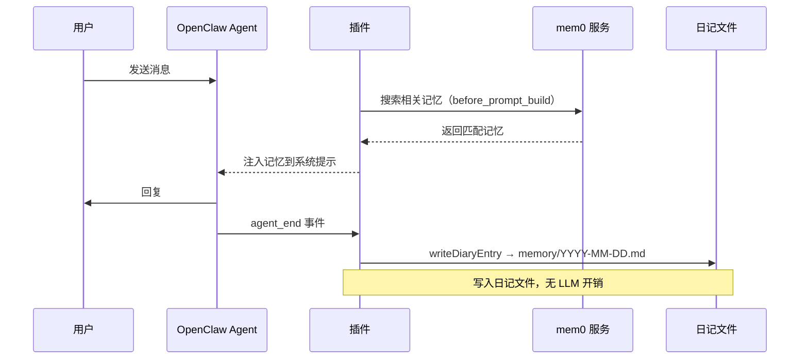
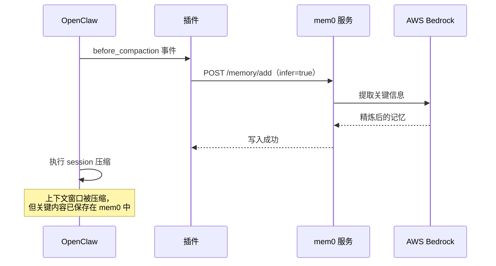

# OpenClaw 插件

mem0 Memory Plugin 通过 Hook 系统接入 OpenClaw 的 agent 生命周期，实现实时日记写入。每次有实质内容的对话都会通过 `agent_end` hook 即时写入日记文件，同时在生成回复前将相关记忆注入系统提示。

## 架构

### 插件在整个记忆系统中的位置



插件与现有流水线互补，各司其职：

| 组件 | 触发时机 | 写入方式 | 用途 |
|------|---------|---------|------|
| **插件**（`agent_end`） | 每次对话 turn 结束 | 日记文件（`writeDiaryEntry`） | 实时日记捕获，零 LLM 开销 |
| **插件**（`before_compaction`） | session 压缩前 | `infer=true` 写入 mem0 | 压缩前 LLM 提炼，防止上下文丢失 |
| **插件**（`before_prompt_build`） | 每次生成回复前 | 仅搜索 | 将相关记忆注入 prompt |
| `auto_digest` | 每 15 分钟（cron） | `infer=true` 写入 mem0 | 从日记文件提取结构化记忆 |
| `auto_dream` | 每天 UTC 02:00（cron） | `infer=true` 写入 mem0 | 短期记忆 → 长期记忆精炼 |

### 时序图：正常对话 turn



### 时序图：session 压缩时



## Hook 说明

### `agent_end` — 写入对话到日记

每次 agent turn 成功结束后触发，提取最后一轮 user + assistant 对话，通过 `writeDiaryEntry` 写入 agent 的日记文件。

**行为：**
- 写入路径：`~/.openclaw/workspace-{agentId}/memory/YYYY-MM-DD.md` — 日记按 agentId 路由到各自 workspace
- 对话内容不足 `minExchangeLength`（默认 100 字）时跳过，过滤寒暄等无效内容
- 通过 `isNoise` 过滤噪音（问候、琐碎对话）
- 通过 `cleanContent` 清理内容（移除系统标记等）
- 每个 session 有 debounce 保护，`debounceMs`（默认 60 秒）内最多写一次
- workspace 基础路径通过 `getWorkspaceBase` 从 `openclaw.json` 解析

### `before_compaction` — 压缩前兜底写入

OpenClaw 即将压缩 session 上下文时触发，将当前对话以 `infer=true` 写入 mem0，确保在上下文丢失前完成 LLM 提炼。

**行为：**
- 始终使用 `infer=true`——这是压缩前最后的捕获机会
- 无 debounce 限制——压缩频率低且关键

### `before_prompt_build` — 注入记忆

每次生成回复前触发，用当前用户消息搜索 mem0，将相关记忆前置注入系统上下文。

**行为：**
- 取用户消息前 200 字作为搜索 query
- 最多返回 `injectLimit`（默认 5）条，截断至 `injectMaxChars`（默认 800 字）
- 超过 `injectTimeoutMs`（默认 3 秒）自动跳过，不阻塞回复
- 以 `## Relevant Memories` 段落形式注入系统提示

## 核心函数

### `writeDiaryEntry(agentId, content)`

将对话内容写入 agent 的每日日记文件。日记路径解析为 `{diaryBasePath}/workspace-{agentId}/memory/YYYY-MM-DD.md`。如果目录不存在会自动创建。以时间戳标题追加内容。

### `cleanContent(text)`

清理对话文本中的系统标记、多余空白和格式噪音，确保日记条目干净可读。

### `isNoise(exchange)`

判断对话是否为噪音（问候、简短确认、琐碎对话），返回 `true` 表示应跳过不写入日记。

### `getWorkspaceBase(agentId)`

从 `openclaw.json` 解析指定 agent 的 workspace 基础路径。返回日记文件应写入的路径（如 `~/.openclaw/workspace-{agentId}`）。如果配置中未找到，回退到 `{diaryBasePath}/workspace-{agentId}`。

## 配置项

所有配置通过 OpenClaw 的 `plugins.entries` 传入。

| 配置项 | 类型 | 默认值 | 说明 |
|--------|------|--------|------|
| `mem0Url` | string | `http://localhost:8230` | mem0 服务地址 |
| `userId` | string | `boss` | mem0 用户 ID |
| `agentIds` | string[] | `["dev","main","pm","researcher","pjm","prototype"]` | 处理的 agent ID 列表（空数组=全部） |
| `diaryBasePath` | string | `~/.openclaw` | 日记文件基础路径。日记写入 `{diaryBasePath}/workspace-{agentId}/memory/YYYY-MM-DD.md` |
| `enableWrite` | boolean | `false` | 开启 `before_compaction` 写入 mem0（infer=true） |
| `enableRawWrite` | boolean | `true` | 开启 `agent_end` 日记文件写入（写入日记文件，不写入 mem0） |
| `enableInject` | boolean | `false` | 开启 `before_prompt_build` 记忆注入 |
| `enableCompactionFlush` | boolean | `true` | 开启 `before_compaction` 压缩前写入 |
| `minExchangeLength` | number | `100` | 触发写入的最小对话长度（字符数） |
| `injectLimit` | number | `5` | 每次注入的最大记忆条数 |
| `injectMaxChars` | number | `800` | 注入内容的最大字符数 |
| `debounceMs` | number | `60000` | 每个 session 写入去重窗口（毫秒） |
| `injectTimeoutMs` | number | `3000` | 记忆搜索超时时间（毫秒） |

> **`enableRawWrite`**：开启后，`agent_end` hook 将对话内容写入日记文件（`memory/YYYY-MM-DD.md`），这是主要的日记捕获机制——零 LLM 开销，实时写入。日记文件随后由 `auto_digest`（每 15 分钟）和 `auto_dream`（每晚）处理，提炼到 mem0 向量记忆中。
>
> **`enableWrite`**：控制 `before_compaction` 行为。开启后，session 压缩事件触发 `infer=true` 直接写入 mem0——这是上下文丢失前最后的捕获机会。

## 安装配置

### 1. 加载插件

在 `~/.openclaw/openclaw.json` 中添加插件加载路径：

```json
{
  "plugins": {
    "load": {
      "paths": [
        "/path/to/mem0-memory-service/openclaw-plugin"
      ]
    },
    "entries": {
      "openclaw-plugin": {
        "enabled": true,
        "config": {
          "mem0Url": "http://localhost:8230",
          "userId": "boss",
          "enableWrite": false,
          "enableRawWrite": true,
          "enableInject": false
        }
      }
    }
  }
}
```

### 2. 验证加载成功

重启 OpenClaw 后，查看日志中是否出现：

```
[mem0-plugin] Registered. mem0Url=http://localhost:8230 userId=boss agentIds=dev,main,pm,...
```

## 推荐配置

对大多数用户，建议使用**日记写入模式**（`enableRawWrite=true`）：

```json
{
  "enableWrite": false,
  "enableRawWrite": true,
  "enableInject": false
}
```

**原因：**
- `agent_end` 将对话写入日记文件，零 LLM 开销，每轮对话结束即时捕获
- `before_compaction` 始终使用 `infer=true`，关键上下文在压缩前得到提炼
- `auto_digest`（每 15 分钟）读取新日记内容写入 mem0 短期记忆
- `auto_dream` 每晚将短期记忆整合为高质量长期知识
- 注入功能（`enableInject`）可按需开启，频率高时建议关闭

## 与现有流水线的关系

插件**不替代**现有的流水线系统，两者协作运行：

```
实时路径（插件）：
  对话  → agent_end          → 日记文件（实时，每轮对话）
  压缩  → before_compaction  → mem0（LLM提炼，兜底）
  提示  → before_prompt_build → 搜索 → 注入

批处理路径（流水线）：
  日记    → auto_digest --today（每15分钟）→ mem0 短期记忆
  每晚    → auto_dream（UTC 02:00）        → 长期记忆精炼
```

- **插件**提供实时日记捕获——对话结束即写入日记文件，无延迟
- **流水线**提供日记到 mem0 的结构化提炼和夜间精炼——长期记忆质量更高
- 两条路径共享同一套日记文件和 mem0 实例——`auto_digest` 读取插件写入的日记文件
