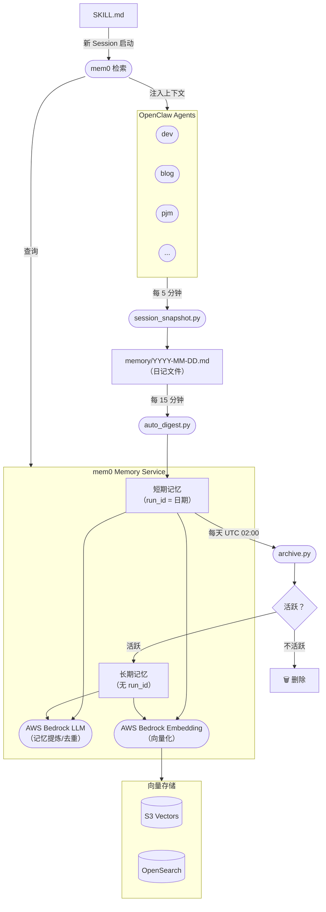

# 系统架构

mem0 Memory Service 是所有 OpenClaw Agent 的中央记忆层。它通过三级流水线（快照 → 摘要 → 归档）接收原始会话数据，利用 AWS Bedrock 将其提炼为语义记忆，并在 Agent 启动时按需注入相关上下文。

## 组件职责

| 组件 | 职责 |
|---|---|
| **session_snapshot.py** | 每 5 分钟运行一次，将各 Agent 的会话状态捕获到日记文件（`memory/YYYY-MM-DD.md`）。 |
| **auto_digest.py** | 每 15 分钟运行一次，将日记内容发送到 mem0 作为短期记忆，标记 `run_id=日期`。 |
| **archive.py** | 每天 UTC 02:00 运行，将活跃的短期记忆升级为长期记忆（移除 `run_id`），删除不活跃的记忆。 |
| **mem0 Memory Service** | 核心服务。使用 AWS Bedrock LLM 进行记忆提炼与去重，使用 Bedrock Embedding 进行向量化。 |
| **向量存储** | 持久化记忆向量，支持 S3 Vectors 或 OpenSearch 作为后端。 |
| **SKILL.md → 检索** | Agent 新会话启动时，读取 SKILL.md，查询 mem0 获取相关记忆，注入为上下文。 |
