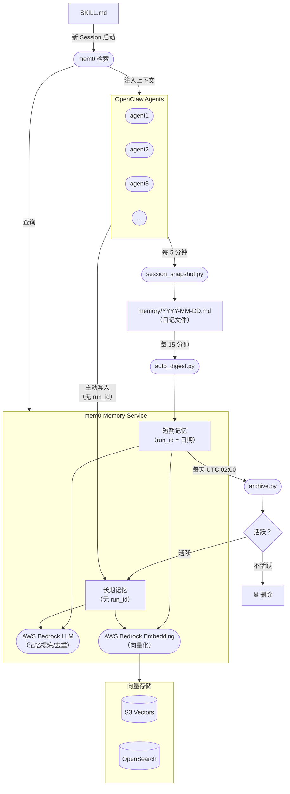

# 系统架构

mem0 Memory Service 是所有 OpenClaw Agent 的中央记忆层。它通过三级流水线（快照 → 摘要 → 归档）接收原始会话数据，利用 AWS Bedrock 将其提炼为语义记忆，并在 Agent 启动时按需注入相关上下文。



## 组件职责

| 组件 | 职责 |
|---|---|
| **session_snapshot.py** | 每 5 分钟运行一次，将各 Agent 的会话状态捕获到日记文件（`memory/YYYY-MM-DD.md`）。 |
| **auto_digest.py** | 每 15 分钟运行一次，将日记内容发送到 mem0 作为短期记忆，标记 `run_id=日期`。 |
| **archive.py** | 每天 UTC 02:00 运行，将活跃的短期记忆升级为长期记忆（移除 `run_id`），删除不活跃的记忆。 |
| **mem0 Memory Service** | 核心服务。使用 AWS Bedrock LLM 进行记忆提炼与去重，使用 Bedrock Embedding 进行向量化。 |
| **向量存储** | 持久化记忆向量，支持 S3 Vectors 或 OpenSearch 作为后端。 |
| **SKILL.md → 检索** | Agent 新会话启动时，读取 SKILL.md，查询 mem0 获取相关记忆，注入为上下文。 |

## 记忆分层：长期 vs 短期由谁决定？

mem0 本身没有长短期概念——默认永久保存所有写入的内容。**长短期的区分完全由写入时是否携带 `run_id` 来决定。**

| | 短期记忆 | 长期记忆 |
|---|---|---|
| **`run_id`** | `YYYY-MM-DD`（日期字符串） | 不传 |
| **写入者** | `auto_digest.py`（自动） | Agent 主动写入，或 `archive.py` 升级 |
| **生命周期** | 7天后触发评估 | 永久保存 |
| **典型内容** | 当天讨论、任务进展、临时决策 | 技术决策、经验教训、用户偏好 |

### 进入长期记忆的两条路径

**路径一 — `archive.py` 自动升级**（被动，每天执行）

7天后，对每条短期记忆进行评估：
- 在过去 6 天的短期记忆中做语义搜索
- 找到相似度 ≥ 0.75 的结果 → **升级**（重新写入，去掉 `run_id`）
- 没有找到 → **删除**

这比简单的时间硬删更智能：持续讨论中的话题得到保留；一次性的临时记录不会污染长期记忆。

**路径二 — Agent 主动写入**（主动，随时可用）

Agent 在对话中遇到重要信息时，直接写入长期记忆（不传 `run_id`）：

```bash
python3 cli.py add --user boss --agent agent1 \
  --text "决定使用 S3 Vectors 作为主要向量存储" \
  --metadata '{"category":"decision"}'
```

适合重要决策、经验教训、用户偏好等需要**立即沉淀**的内容，无需等待 7 天归档周期。

### `run_id` 机制

`run_id` 是 mem0 原生的按运行隔离的 key，我们将其复用为按日期划分的命名空间：

```
run_id = "2026-03-27"   →  短期记忆（当天条目）
run_id = 不传           →  长期记忆（永久保存）
```

检索时同样遵循这个规则：可以单独检索长期、单独检索短期（指定日期），或两者合并（`--combined`）。
