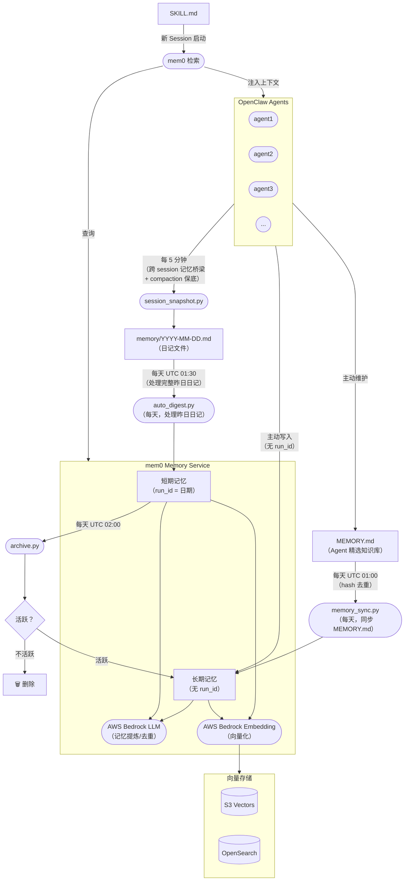

# 系统架构

mem0 Memory Service 是所有 OpenClaw Agent 的中央记忆层。它通过流水线（快照 → 摘要 → 归档）接收会话数据，利用 AWS Bedrock 将其提炼为语义记忆，并在 Agent 启动时按需注入相关上下文。



## 组件职责

| 组件 | 职责 |
|---|---|
| **session_snapshot.py** | 每 5 分钟运行一次。核心定位：**跨 session 记忆桥梁**——将会话对话捕获到日记文件，确保上下文在 session 重置后不丢失。同时兼具 compaction 保底功能。 |
| **auto_digest.py** | 每天 UTC 01:30 运行。一次性处理**昨天的完整日记**——比增量处理质量更高。使用 LLM 提炼关键事件，写入 mem0 短期记忆（`run_id=日期`）。 |
| **memory_sync.py** | 每天 UTC 01:00 运行。将各 Agent 的 `MEMORY.md`（精选知识）直接同步到 mem0 长期记忆。基于内容 hash 去重，文件未变化时零 LLM 调用。 |
| **archive.py** | 每天 UTC 02:00 运行，将活跃的短期记忆升级为长期记忆（移除 `run_id`），删除不活跃的记忆。 |
| **mem0 Memory Service** | 核心服务。使用 AWS Bedrock LLM 进行记忆提炼与去重，使用 Bedrock Embedding 进行向量化。 |
| **向量存储** | 持久化记忆向量，支持 S3 Vectors 或 OpenSearch 作为后端。 |
| **SKILL.md → 检索** | Agent 新会话启动时，读取 SKILL.md，查询 mem0 获取相关记忆，注入为上下文。 |

## 每日流水线时序（UTC）

```
01:00  memory_sync   — MEMORY.md → mem0 长期记忆（精选知识，即时生效）
01:30  auto_digest   — 昨日日记 → mem0 短期记忆（完整当天上下文）
02:00  archive       — 7天前短期记忆 → 升级或删除
```

## 记忆分层：长期 vs 短期由谁决定？

mem0 本身没有长短期概念——默认永久保存所有写入的内容。**长短期的区分完全由写入时是否携带 `run_id` 来决定。**

| | 短期记忆 | 长期记忆 |
|---|---|---|
| **`run_id`** | `YYYY-MM-DD`（日期字符串） | 不传 |
| **写入者** | `auto_digest.py`（自动） | Agent 主动写入、`memory_sync.py` 或 `archive.py` 升级 |
| **生命周期** | 7天后触发评估 | 永久保存 |
| **典型内容** | 当天讨论、任务进展、临时决策 | 技术决策、经验教训、用户偏好 |

### 进入长期记忆的三条路径

**路径一 — `memory_sync.py`**（每天，来自 `MEMORY.md`）

每个 Agent 的 `MEMORY.md` 是质量最高的记忆来源——Agent 在 heartbeat 时主动维护，是其所学知识的精华提炼。`memory_sync.py` 每天 UTC 01:00 将其同步到 mem0 长期记忆，基于 hash 去重避免重复 LLM 调用。

这是**最快的路径**：重要决策和经验教训当天就能进入长期记忆，无需等待 7 天归档周期。

**路径二 — `archive.py`**（每天，从短期记忆自动升级）

7天后，对每条短期记忆进行评估：
- 在过去 6 天的短期记忆中做语义搜索
- 找到相似度 ≥ 0.75 的结果 → **升级**（重新写入，去掉 `run_id`）
- 没有找到 → **删除**

适合那些跨多天讨论、但未被明确记录到 `MEMORY.md` 的话题。

**路径三 — Agent 主动写入**（随时，按需）

Agent 在对话中遇到重要信息时，直接写入长期记忆（不传 `run_id`）：

```bash
python3 cli.py add --user boss --agent agent1 \
  --text "决定使用 S3 Vectors 作为主要向量存储" \
  --metadata '{"category":"decision"}'
```

### `run_id` 机制

`run_id` 是 mem0 原生的按运行隔离的 key，我们将其复用为按日期划分的命名空间：

```
run_id = "2026-03-27"   →  短期记忆（当天条目）
run_id = 不传           →  长期记忆（永久保存）
```

## 设计理念

### 为什么 session_snapshot 是必须的

OpenClaw 默认每天 4:00 AM 或空闲超时后重置 session，创建全新上下文窗口。没有桥梁机制，每次 session 重置后所有对话历史都会消失。

`session_snapshot.py` 就是这座桥：每 5 分钟将对话捕获到日记文件，再由 `auto_digest.py` 提炼进 mem0。新 session 启动时，SKILL.md 触发 mem0 检索——上下文在 session 切换间无缝恢复。

### 为什么改为每天一次 digest

原始方案每 15 分钟增量处理一次日记，需要 `.digest_state.json` 记录文件偏移量。这带来了：
- 每个 agent 每天约 96 次 LLM 调用（成本高、每次质量低）
- 从不完整对话片段中提炼，上下文碎片化
- 状态管理复杂，容易出现偏移量错位 bug

改为每天处理**昨天的完整日记**，LLM 能看到一整天发生了什么，产出质量更高，成本降低约 96%。

### 为什么 MEMORY.md 是独立路径

`MEMORY.md` 是 Agent 在 heartbeat 时自己维护的，是其所学知识的精华——这在质量上与日记提取的短期记忆有本质区别。

将 `MEMORY.md` 直接路由到长期记忆（跳过短期 → 7天归档的流程），确保明确整理过的知识在后续 session 中立即可用。
