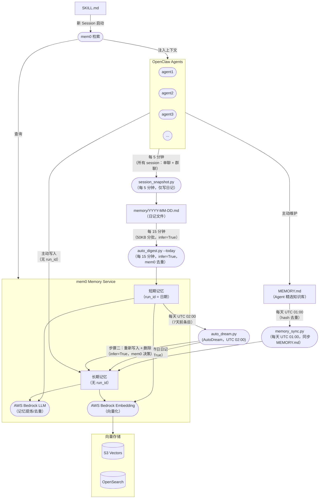

# 系统架构

mem0 Memory Service 是所有 OpenClaw Agent 的中央记忆层。它通过流水线（快照 → 摘要 → 归档）接收会话数据，利用 AWS Bedrock 将其提炼为语义记忆，并在 Agent 启动时按需注入相关上下文。



## 组件职责

| 组件 | 职责 |
|---|---|
| **session_snapshot.py** | 每 5 分钟运行一次。捕获**所有** Agent 会话（单聊 + 群聊）到日记文件。**不直接写入 mem0**——mem0 的写入完全由 auto_digest 负责。 |
| **auto_digest.py --today** | 每 15 分钟运行一次。读取自上次运行以来日记文件中的**新增字节**（通过 `auto_digest_offset.json` 追踪），以**按 `## ` 章节边界对齐的分批**（每批最大约 50KB）加 `infer=True` 写入 mem0——mem0 自动处理事实提取和去重。每批成功后立即持久化 offset，支持断点续传。 |
| **memory_sync.py** | 每天 UTC 01:00 运行。将各 Agent 的 `MEMORY.md`（精选知识）直接同步到 mem0 长期记忆。基于 hash 去重，文件未变化时零 LLM 调用。 |
| **auto_dream.py** / **AutoDream** | 每天 UTC 02:00 运行。**步骤一**：读取昨日完整日记 → `mem0.add(infer=True, 无 run_id)` → 长期记忆。**步骤二**：对每条 7 天前的短期记忆，调用 `mem0.add(infer=True, 无 run_id)`——mem0 LLM 与已有长期记忆比对，返回四种决策之一：`ADD`（新知识，写入）、`UPDATE`（与已有条目合并）、`DELETE`（冗余，跳过写入）、`NONE`（已完全覆盖，跳过写入）。无论何种决策，**原始短期条目处理后始终删除**。 |
| **mem0 Memory Service** | 核心服务。使用 AWS Bedrock LLM 进行记忆提炼与去重，使用 Bedrock Embedding 进行向量化。 |
| **向量存储** | 持久化记忆向量，支持 S3 Vectors 或 OpenSearch 作为后端。 |
| **SKILL.md → 检索** | Agent 新会话启动时，读取 SKILL.md，查询 mem0 获取相关记忆，注入为上下文。 |

## 流水线时序（UTC）

```
每 5 分钟    session_snapshot    — 对话 → 日记文件（不写 mem0）
每 15 分钟   auto_digest --today — 日记新增内容 → mem0 短期记忆（infer=True，mem0 去重）
01:00        memory_sync         — MEMORY.md → mem0 长期记忆（精选知识，即时生效）
02:00        auto_dream          — 步骤一：昨日日记 → 长期记忆（infer=True）
                                   步骤二：7天前短期记忆 → 重新写入（infer=True）+ 删除
```

## 记忆分层：长期 vs 短期由谁决定？

mem0 本身没有长短期概念——默认永久保存所有写入的内容。**长短期的区分完全由写入时是否携带 `run_id` 来决定。**

| | 短期记忆 | 长期记忆 |
|---|---|---|
| **`run_id`** | `YYYY-MM-DD`（日期字符串） | 不传 |
| **写入者** | `auto_digest.py --today`（自动） | Agent 主动写入、`memory_sync.py` 或 `auto_dream.py` / AutoDream（infer=True 整合） |
| **生命周期** | 7天后由 auto_dream 整合 | 永久保存 |
| **典型内容** | 当天讨论、任务进展、临时决策 | 技术决策、经验教训、用户偏好 |

### 进入长期记忆的三条路径

**路径一 — `memory_sync.py`**（每天 UTC 01:00，来自 `MEMORY.md`）

每个 Agent 的 `MEMORY.md` 是质量最高的记忆来源——Agent 在 heartbeat 时主动维护，是其所学知识的精华提炼。`memory_sync.py` 每天 UTC 01:00 将其同步到 mem0 长期记忆，基于 hash 去重避免重复 LLM 调用。

这是**最快的路径**：重要决策和经验教训当天就能进入长期记忆，无需等待 7 天归档周期。

**路径二 — `auto_dream.py` / AutoDream**（每天 UTC 02:00）

每晚执行两个步骤：

- **步骤一**：读取昨日完整日记，以 `infer=True`（无 `run_id`）写入 mem0——直接进入长期记忆，利用全天完整上下文提取高质量知识。
- **步骤二**：对每条 7 天前的短期记忆，调用 `mem0.add(infer=True, 无 run_id)`。mem0 LLM 将该条记忆与已有长期记忆比对，返回四种决策之一：
  - `ADD` — 新知识 → 写入新的长期记忆条目
  - `UPDATE` — 与已有条目重叠 → 合并/更新
  - `DELETE` — 冗余或被已有知识覆盖 → 跳过写入
  - `NONE` — 已完全覆盖 → 跳过写入

  无论何种决策，**原始短期条目处理后始终删除**。

利用 mem0 原生智能，取代了之前手写的语义搜索逻辑，消除了每次运行数千次冗余的 Bedrock API 调用。

**路径三 — Agent 主动写入**（随时，按需）

Agent 在对话中遇到重要信息时，直接写入长期记忆（不传 `run_id`）：

```bash
python3 cli.py add --user boss --agent agent1 \
  --text "决定使用 S3 Vectors 作为主要向量存储" \
  --metadata '{"category":"decision"}'
```

### `run_id` 机制

`run_id` 是 mem0 原生的按运行隔离的 key，我们将其复用为按日期划分的命名空间：

```
run_id = "2026-03-27"   →  短期记忆（当天条目）
run_id = 不传           →  长期记忆（永久保存）
```

## 设计理念

### 日记到 mem0 的流水线

**`auto_digest.py --today`（每 15 分钟，增量）**

每 15 分钟运行一次，只读取自上次运行以来的新增内容。以**按 `## ` 章节边界对齐的分批**（每批最大约 50KB）加 `infer=True` 发给 mem0——mem0 自动做 fact extraction 和去重。每批成功后立即保存 offset——即使进程中断，下次运行也能从断点继续。

这提供了**实时跨 session 记忆**：最近 ~15 分钟的对话可在同一 agent 的其他 session 中被检索到。

**`auto_dream.py` 步骤一（UTC 02:00，昨日日记 → 长期记忆）**

每天运行一次。读取昨日完整日记，以 `infer=True`（无 `run_id`）写入 mem0——直接进入长期记忆。利用全天完整上下文，mem0 提取质量更高、去重更彻底的知识。

这提供了**高质量的夜间长期记忆**，充分利用整天的完整上下文。

### 为什么 session_snapshot 不再写入 mem0

最初，`session_snapshot.py` 每 5 分钟运行时会直接将新消息写入 mem0。这导致了线程爆炸：每次写入都会同时触发多个 agent 的 mem0 内部 LLM（fact extraction）+ embedding 流水线，将服务打满。

修复方案是清晰的职责分离：
- `session_snapshot` → **仅写日记文件**（快速，无外部调用）
- `auto_digest --today` → **写入 mem0**（限速，按章节对齐的 50KB 分批，批次间 sleep）

### 为什么 MEMORY.md 是独立路径

`MEMORY.md` 是 Agent 在 heartbeat 时自己维护的，是其所学知识的精华——这在质量上与日记提取的短期记忆有本质区别。

将 `MEMORY.md` 直接路由到长期记忆（跳过短期 → 7天归档的流程），确保明确整理过的知识在后续 session 中立即可用。
